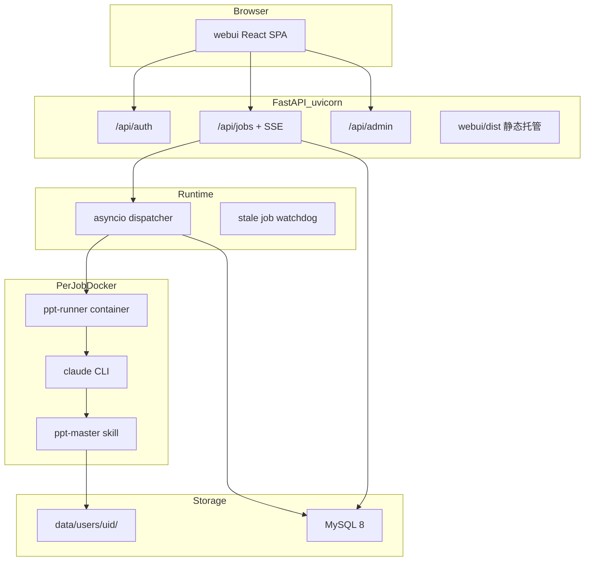
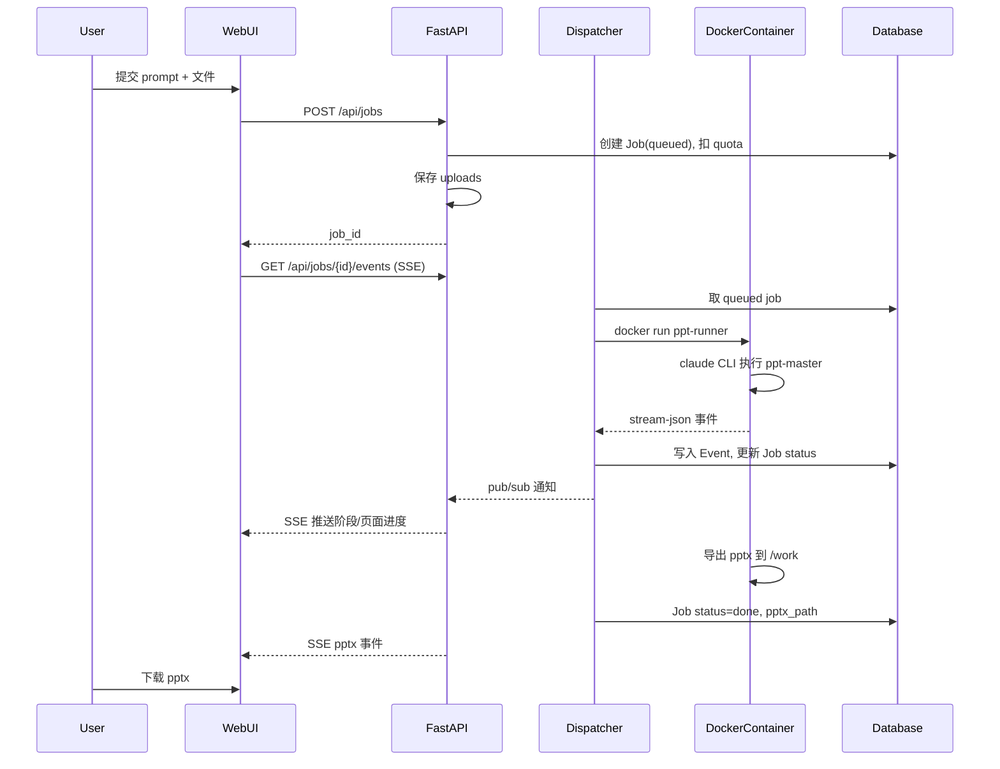

# 架构

> 最后更新：2026-06-21

> 最后更新：2026-06-21  
> 相关代码：[`backend/main.py`](../backend/main.py)、[`webui/`](../webui/)、[`docker/ppt-runner/`](../docker/ppt-runner/)

### 架构图


> 可编辑源文件：[architecture/ppt-web-architecture.drawio](architecture/ppt-web-architecture.drawio)

简版（mermaid）：



### 分层说明

#### 浏览器层（webui）

React 19 + Vite 8 单页应用，构建产物 `webui/dist/` 由 FastAPI 托管。开发模式下 Vite dev server（`:5173`）将 `/api` 代理到后端（`:8765`）。

页面路由见 [frontend-guide.md](development.md#前端开发指南)。

#### API 层（backend）

FastAPI 应用，入口 `backend.main:app`：

| 模块 | 职责 |
|------|------|
| `api/routes/auth.py` | 注册、登录、JWT cookie |
| `api/routes/jobs.py` | 任务 CRUD、SSE 事件流、文件下载 |
| `admin/router.py` | 管理后台 API |
| `api/routes/spa.py` | 静态 SPA 托管 + fallback |

#### 运行时层（runtime）

进程内 asyncio 实现，**无 Celery/Redis**：

- **dispatcher**：从 DB 取 `queued` 任务，受 `MAX_CONCURRENT_JOBS` 限制，启动 Docker runner
- **watchdog**：检测超时/卡住的 job，标记失败并退款
- **events**：内存 pub/sub + DB 持久化，供 SSE 订阅

#### 执行层（runner）

每个 job 在独立 Docker 容器中运行：

```
docker run --rm -i \
  --name ppt-job-<job_id> \
  -v data/users/<uid>/:/work \
  -e PROMPT=... -e JOB_ID=... \
  -e ANTHROPIC_*=... \
  --memory=4g --cpus=2 --network=ppt-isolated \
  ppt-runner:latest
```

容器内执行 `claude --print`，驱动 ppt-master SKILL.md 流水线。详见 [execution-pipeline.md](architecture.md#任务执行流水线)。

#### 存储层

| 类型 | 位置 | 用途 |
|------|------|------|
| 关系数据库 | MySQL 8（`DB_URL`） | User、Job、Event、AppConfig |
| 文件系统 | `data/users/<uid>/` | 上传文件、生成产物 |

### 与原始 DESIGN.md 的差异

| 原设计 | 当前实现 |
|--------|----------|
| Next.js 前端 | Vite + React SPA |
| Celery + Redis 队列 | asyncio 进程内 dispatcher |
| Claude Agent SDK hooks | `claude CLI` + stream-json 解析 |
| WebSocket 进度推送 | Server-Sent Events (SSE) |
| S3/MinIO 对象存储 | 本地 `data/users/` 目录 |
| projects/versions 多表 | 简化为 Job 单表 + 文件目录 |

原设计中的 Agent SDK、Celery、对象存储等仍可作为后续演进方向，见 [features.md](product.md#功能实现状态)。

### 请求生命周期（创建任务）



### 相关文档

- [execution-pipeline.md](architecture.md#任务执行流水线) — Docker runner 与 claude 执行细节
- [progress-events.md](architecture.md#进度事件与阶段映射) — SSE 事件类型与阶段映射
- [data-model.md](architecture.md#数据模型与文件布局) — 数据库与文件布局

---

> 最后更新：2026-06-21  
> 相关代码：[`backend/runner/`](../backend/runner/)、[`docker/ppt-runner/`](../docker/ppt-runner/)、[`ppt-master/skills/ppt-master/SKILL.md`](../ppt-master/skills/ppt-master/SKILL.md)

### 执行路径概览

```
FastAPI dispatcher
  └─ backend/runner/claude.py   ← 编排 claude 调用
       └─ backend/runner/docker.py  ← 构建 docker run 命令
            └─ ppt-runner 容器
                 └─ entrypoint.sh
                      └─ claude --print --output-format stream-json
                           └─ 读取 ppt-master/SKILL.md，执行完整流水线
```

### Docker Runner 镜像

镜像定义：[`docker/ppt-runner/Dockerfile`](../docker/ppt-runner/Dockerfile)

包含：

- Python 3.11 + Node.js
- `claude` CLI（Anthropic Claude Code）
- ppt-master 源码及 pip 依赖
- 中英文字体（CJK 渲染）

构建：

```bash
bash docker/ppt-runner/build.sh
## 产出 ppt-runner:latest（约 1.5GB，首次 5–10 分钟）
```

`build.sh` 同时创建 `ppt-isolated` bridge 网络。

### 容器挂载与隔离

每个 job 容器：

| 配置 | 默认值 | 说明 |
|------|--------|------|
| 挂载 | `data/users/<uid>/` → `/work` | 上传与产物共享 |
| 网络 | `ppt-isolated` | 独立 bridge，避免端口冲突 |
| 内存 | `4g` | `DOCKER_RUNNER_MEMORY` |
| CPU | `2` | `DOCKER_RUNNER_CPUS` |
| 超时 | `1800s` | 超时强杀容器 |
| 生命周期 | `--rm` | 退出后自动销毁 |

容器名：`ppt-job-<job_id>`，便于 cancel 时 `docker stop`。

### Claude CLI 调用

backend 通过 `backend/runner/claude.py` 启动容器，核心参数：

- `--print`：非交互 headless 模式
- `--output-format stream-json`：结构化事件流，供进度解析
- `--resume <session_id>`：恢复暂停的会话（八点确认后）

环境变量通过 Admin 配置或 `.env` 注入容器，包括：

- `ANTHROPIC_AUTH_TOKEN` / `ANTHROPIC_API_KEY`
- `ANTHROPIC_MODEL` / `ANTHROPIC_DEFAULT_*_MODEL`
- `ANTHROPIC_BASE_URL`（兼容第三方 API）

### ppt-master 流水线

agent 在容器内按 SKILL.md 执行串行步骤：

1. **解析素材** — `source_to_md/*.py` 将上传文档转 Markdown
2. **建项目** — `project_manager.py init <name> --format ppt169`
3. **策略规划** — Strategist 生成 `design_spec.md` + `spec_lock.md`
4. **（可选）八点确认** — BLOCKING 暂停，等待用户确认（默认自动跳过）
5. **生图** — `image_gen.py` / `image_search.py`
6. **逐页 SVG** — Executor 逐页写 `svg_output/*.svg`
7. **质检** — `svg_quality_checker.py`
8. **后处理 + 导出** — `finalize_svg.py` → `svg_to_pptx.py` → `exports/*.pptx`

产物目录命名：`<name>_<format>_<date>/`，backend 通过 `resolve_project_dir()` 按前缀 glob 查找。

### 暂停与恢复

当 agent 在八点确认处 `end_turn` 且无 pptx 产出时，backend 判定 job 为 `paused`：

1. 保存 `session_id` 到 Job 表
2. 向前端 SSE 推送 `paused` 事件
3. 用户调用 `POST /api/jobs/{id}/resume` 提交确认文本
4. dispatcher 以 `--resume <session_id>` 重启容器继续

**当前默认行为**：`require_confirm=False`，agent 暂停时 backend 自动注入 `AUTO_CONFIRM_TEXT`（「确认，按你的推荐方案继续生成。」）并 resume，最多 `SKIP_EIGHT_CONFIRM_MAX` 轮。

### 备选方案（未采用）

DESIGN.md 曾建议两条路线：

| 路线 | 说明 | 状态 |
|------|------|------|
| **A. 跑完整 skill**（当前） | claude CLI 驱动 SKILL.md | ✅ 已验证 |
| **B. 脚本编排 + 局部 Claude** | 确定性步骤直接调 Python，仅 Strategist/Executor 用模型 | ⬜ 未实现，维护成本高 |

Claude Agent SDK（hooks、PreToolUse 白名单）也是备选，当前用 stream-json 解析替代。若需更强控制可后续迁移。

### 相关文档

- [docker-runner.md](deployment.md#docker-runner-镜像) — 镜像构建与运维
- [progress-events.md](architecture.md#进度事件与阶段映射) — 如何从 stream-json 映射阶段
- [phase0/REPORT.md](../phase0/REPORT.md) — Phase 0 验证结论

---

> 最后更新：2026-06-21  
> 相关代码：[`backend/runner/stages.py`](../backend/runner/stages.py)、[`backend/runtime/events.py`](../backend/runtime/events.py)、[`backend/api/routes/jobs.py`](../backend/api/routes/jobs.py)

### SSE 事件流

前端通过 `GET /api/jobs/{job_id}/events` 订阅 Server-Sent Events：

- **历史回放**：连接时先推送 DB 中 `seq > from_seq` 的已有事件
- **实时订阅**：通过内存 pub/sub 接收新事件
- **断线续传**：请求头 `Last-Event-ID` 或 query `from_seq`
- **心跳**：15 秒无事件时发送 `: ping`

SSE 格式：

```
id: 42
event: stage
data: {"stage": "6 逐页生成 SVG", "detail": "svg_output/03_xxx.svg"}
```

### 事件类型

| type | 含义 | payload 示例 |
|------|------|-------------|
| `stage` | 流水线阶段推进 | `{stage, command?, file?}` |
| `page` | 逐页 SVG 进度 | `{page, total?, file}` |
| `text` | agent 文本输出 | `{text}` |
| `paused` | 等待用户确认 | `{reason, session_id?}` |
| `pptx` | 导出完成 | `{url, path?}` |
| `error` | 失败 | `{message}` |
| `done` | 任务结束 | `{status, cost_usd?}` |

### 阶段映射规则

定义于 [`backend/runner/stages.py`](../backend/runner/stages.py) 的 `STAGE_RULES`：

| 阶段 | 触发条件 |
|------|----------|
| 1 解析素材 | Bash 命令含 `source_to_md` |
| 2 建项目 | 命令含 `project_manager.py init` 或 `import` |
| 3 策略规划 | **Write** 工具写入 `design_spec.md` 或 `spec_lock.md` |
| 5 生图 | 命令含 `image_gen.py` 或 `image_search.py` |
| 6 逐页生成 SVG | 文件路径匹配 `svg_output/*.svg` |
| 7 质检 | 命令含 `svg_quality_checker.py` |
| 8 后处理 | 命令含 `finalize_svg.py` 或 `total_md_split.py` |
| 8 导出 PPTX | 命令含 `svg_to_pptx.py` |

**Read/Write 区分**：阶段 3 仅在 `write=True` 时触发。Executor 每页前重读 `spec_lock.md`（SKILL 规则）不会误标为阶段 3。

### stream-json 解析

claude CLI 以 `--output-format stream-json --verbose` 输出 JSON 行。backend 解析 `type:assistant` 消息中的 `tool_use` 块：

- **Bash** 工具 → 提取 command，匹配 STAGE_RULES
- **Write** 工具 → 提取 file_path + write=True
- **Read** 工具 → 提取 file_path + write=False

逐页 SVG 通过正则 `svg_output/.*\.svg$` 识别，每新增一页推送 `page` 事件。

### 前端展示

[`webui/src/pages/JobDetailPage.tsx`](../webui/src/pages/JobDetailPage.tsx) 消费 SSE：

- 时间线展示各阶段及时间戳
- 阶段 6 显示「第 N 页」进度
- `paused` 状态显示确认面板（若用户手动 resume）
- `pptx` 事件触发下载按钮可用

### 与 DESIGN.md 原设计的差异

| 原设计 | 当前实现 |
|--------|----------|
| Agent SDK PostToolUse hooks | stream-json 解析 tool_use |
| WebSocket (Socket.io) | SSE |
| 自定义工具 `request_design_confirmation` | 检测 agent end_turn + 无 pptx → paused |

### 调试

- Job 详情页可查看完整事件历史（DB `events` 表）
- Phase 0 CLI：`python phase0/orchestrator.py run --prompt "..."` 在终端打印阶段
- smoke test：`.venv/bin/python backend/scripts/smoke.py "..."`

---

> 最后更新：2026-06-21  
> 相关代码：[`backend/models/__init__.py`](../backend/models/__init__.py)、[`backend/paths.py`](../backend/paths.py)

### 数据库模型（当前实现）

使用 SQLAlchemy 2 ORM，连接 MySQL 8（`DB_URL=mysql+pymysql://…`）。

#### User

| 字段 | 类型 | 说明 |
|------|------|------|
| id | UUID string | 主键 |
| email | string | 唯一，登录名 |
| password_hash | string | bcrypt |
| quota_credits | int | 预扣式配额，默认 100 |
| role | string | `user` \| `admin` |
| created_at / updated_at | datetime | |

#### Job

| 字段 | 类型 | 说明 |
|------|------|------|
| id | UUID string | 主键 |
| user_id | FK → User | 多用户隔离 |
| prompt | text | 用户输入 |
| project_name | string | ppt-master 项目名 |
| status | string | 见下方状态机 |
| session_id | string? | claude 会话 ID，用于 resume |
| project_dir | text? | 解析后的产物目录 |
| pptx_path | text? | 最终 pptx 绝对路径 |
| cost_usd | float? | 本次消耗美元 |
| last_agent_text | text? | agent 最后一段文本 |
| last_event_seq | int | 最后事件序号 |
| require_confirm | bool | 是否启用八点确认（默认 false） |
| pending_confirm | text? | resume 时的确认文本（持久化） |
| options_json | text? | 任务选项 JSON |
| error_message | text? | 失败原因 |
| created_at / updated_at | datetime | |

**Job 状态机**：

```
queued → running → done
                 → failed
                 → cancelled
         running → paused → running → ...
```

#### Event

| 字段 | 类型 | 说明 |
|------|------|------|
| id | int | 自增主键 |
| job_id | FK | |
| seq | int | 单 job 内单调递增 |
| type | string | stage/page/text/paused/pptx/error/done |
| payload | text | JSON 字符串 |
| created_at | datetime | |

索引：`(job_id, seq)` 供 SSE 回放。

#### AppConfig

单行全局配置（id=1）：

| 字段 | 说明 |
|------|------|
| settings_json | 非 secret 运行时配置（并发、docker、watchdog、claude_env） |
| secrets_json | API key 等 secret |
| version | 配置版本号 |
| updated_by | 最后修改的 admin user_id |

#### AdminActionLog

Admin 操作审计：admin_user_id、action、target_type/id、payload_json、created_at。

### 规划中的扩展模型

DESIGN.md 曾设计更丰富的 schema，尚未实现：

```
projects(id, user_id, name, canvas_format, status, ...)
  └ sources(id, project_id, filename, storage_key, kind)
  └ versions(id, project_id, pptx_key, svg_snapshot_key, ...)
  └ spec_confirmations(id, job_id, spec_json, user_response, ...)
```

当前以 **Job 单表 + 文件目录** 简化实现。一个 Job 对应一次生成，产物在 `data/users/` 下。未来可引入 projects/versions 支持同一 PPT 多次调优与版本回溯。

### 文件系统布局

根目录：[`backend/paths.py`](../backend/paths.py)

```
data/
└── users/
    └── <user_id>/
        ├── uploads/
        │   └── <job_id>/
        │       ├── report.pdf
        │       └── notes.docx
        └── projects/
            └── <job_id>/                    ← agent init --dir 指向这里
                └── <name>_ppt169_<date>/    ← 实际产物目录
                    ├── design_spec.md
                    ├── spec_lock.md
                    ├── svg_output/
                    │   ├── 01_封面.svg
                    │   └── ...
                    ├── exports/
                    │   └── *.pptx
                    └── backup/              ← ppt-master 自动镜像
```

**路径安全**：

- 上传文件名经 `safe_stage_name()` 归一化（ASCII、限长）
- 下载 preview/pptx 时校验路径在允许根目录下（`is_under()`）

### 数据库迁移

启动时自动执行链式迁移（[`backend/db/migrations.py`](../backend/db/migrations.py)）：

| 迁移 | 内容 |
|------|------|
| v1→v2 | 引入 User 表，Job 加 user_id |
| v2→v3 | Job 加 require_confirm |
| v3→v4 | Job 加 pending_confirm |
| v4→v5 | AppConfig + AdminActionLog |
| v5→v6 | Job 加 options_json |

启动时自动执行链式迁移 v1→v6，迁移逻辑针对 MySQL 优化。

### 相关文档

- [environment-variables.md](reference.md#环境变量参考) — `DB_URL` 配置
- [design/tuning-and-versions.md](design.md#调优与版本管理) — 未来版本管理设计
---

## 相关文档

- [README.md](README.md) — 文档导航
- [product.md](product.md) — 产品
- [architecture.md](architecture.md) — 架构
- [design.md](design.md) — 设计（详细；根目录 [DESIGN.md](../DESIGN.md) 为摘要索引）
- [development.md](development.md) — 开发
- [deployment.md](deployment.md) — 部署
- [reference.md](reference.md) — 参考
